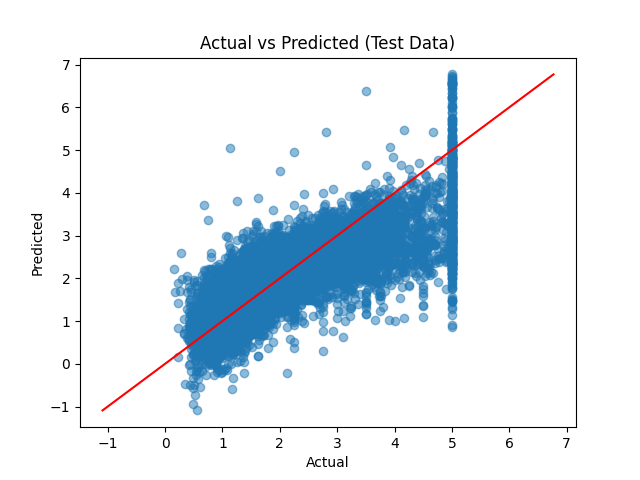

# 重回帰分析

# 利用したオープンデータセット
カリフォルニア住宅価格データセット。上から5000行のデータだけ使った。

| 変数名 | 日本語での説明 |
|:------:|:------:|
| MedInc | 地区の世帯所得の中央値 |
| HouseAge | 地区の住宅の築年数 |
| AveRooms | 地区の住宅の平均部屋数 |
| AveBedrms | 地区の住宅の平均寝室数 |
| Population | 地区の総人口 |
| AveOccup | 地区の1世帯あたりの平均人数 |
| Latitude | 地区の緯度 |
| Longitude | 地区の経度 |
| MedHouseValue | 地区の住宅価格の中央値 |

# 結果

説明変数 : `MedInc`, `HouseAge`, `AveRooms`, `Latitude`, `Longitude`

目的変数 : `MedHouseValue`

<!---
## TODO
学習データで評価してしまっているので、なおす
--->

# 参考リンク
+ 重回帰分析の正規方程式の数学的導出 https://tutorials.chainer.org/ja/07_Regression_Analysis.html
+ ほか https://zenn.dev/omochimaru/articles/9b289f4a9455b7
